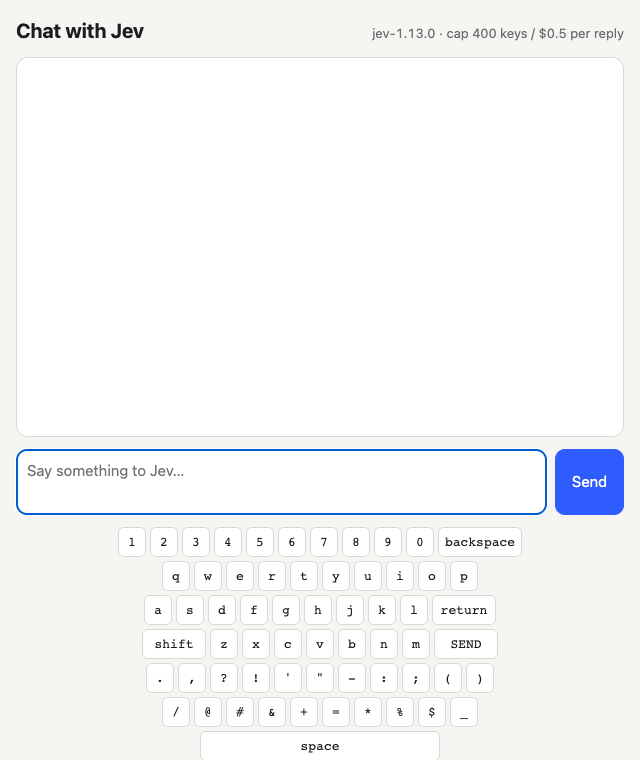

# say-hi

**Can a model that only picks from a list learn to talk?**

Repository: **https://github.com/huemorgan2/say-hi**



[JEV](https://typesafe.ai) (TypeSafe's `jev-1.13.0`) isn't a text generator. It's a *chooser*: you send it a situation (`state`) and a question with a set of options (`criteria`), and it picks one, with a confidence and a probability for every option. **say-hi** tries to get it to talk anyway, by giving it a keyboard. Every reply is typed **one key per JEV request**: letters, digits, punctuation, space, backspace, return and a SEND key.

It's a fun experiment with Jev, and a starting point for **simple chatbots with canned responses**: replace the keyboard (or the answer list) with your own canned replies, and Jev picks the best one for each message.

## Run it

```bash
git clone https://github.com/huemorgan2/say-hi.git
cd say-hi
npm install
cp .env.example .env      # then put your TypeSafe key in TYPESAFE_API_KEY
npm start                 # http://localhost:4317
```

Requires Node 21.7+. The key stays on the server; without it, the page shows a configuration error (there is no fake brain). Every reply has hard caps: 400 keystrokes and $0.50 (`JEV_CHAT_MAX_KEYSTROKES`, `JEV_CHAT_MAX_USD_PER_REPLY`). A **Stop** button aborts the current request.

The page shows the chat, an on-screen keyboard that lights up each key Jev presses, and a live `time · keys · cost` line under each reply. The **JEV calls** panel on the right has one chip per request. Click a chip to see the exact request sent, the top options with their probabilities, and the raw response. Everything is also appended to `logs/YYYY-MM-DD.jsonl` (git-ignored; the key is never logged).

## How a reply is made

1. **Plan**: one request, where Jev picks the reply's goal: greet, introduce, answer, repeat, feeling, support, ask, correction, goodbye or chat.
2. **Answer**: Jev picks the key word of its reply (for a question, the answer itself) from ~10,000 candidates: your words, numbers 0–255, years 1900–2100, and the most frequent English words. A JEV question may list at most 255 options, so this runs as a **tournament**: groups of 250 asked in parallel, then a final between the group winners. Every round also offers `NONE`, meaning "I'll type it myself". This step is skipped for greetings, goodbyes and repeats.
3. **Typing**: one request per key. The `state` holds the conversation, the goal, the chosen answer word, the reply typed so far, the current word and the last character. Every option shows how the reply will read after that key, plus a hint: for a letter, which real words it leads to; for space or punctuation, whether it finishes a real word; for a digit, which number it builds. Once a word is started, whole-word completions from [predictionary](https://github.com/asterics/predictionary) are offered as well (`word:hello`). Keys that only cause loops are not offered (double spaces, retyping a letter just deleted, repeating the previous word, more than 12 words, and so on). The loop ends when Jev presses **SEND**.

## What we learned

- **Jev knows answers but can't spell its way to them.** Letter by letter it answered 3x4 with "8", and "who invented relativity" with word salad. Offered whole answers, it picks `12`, `19`, `2000`, `Einstein`, and `2 × 10^30 kg` for the sun's mass, each at about 100%. A single letter doesn't look like the answer, so the first key is a guess. Once a word is under way it spells perfectly (after `inv` it chose e-n-t-e-d at 96–99% each). The answer tournament exists because of this.
- **The hints do most of the work.** Showing each key's result and the words it leads to took spelling from 70% to about 100%.
- **Plain text beats clever markup.** Previews with normal spaces scored better than previews with a visible `·` for space.
- Measured on a scripted 18-turn English conversation (`npm run eval`, score out of 3 for SEND + real words + correct answer): **2.47 → 2.77** across 16 measured iterations.
- Still weak: open-ended advice (word salad), answers that are neither one word nor a small number (30x50 → "100"), and words outside the vocabulary ("meow").

## The cost of saying "hi"

Measured with say-hi on 2026-09-30, and compared with a normal chat request to three LLMs.

| Model | Price per 1M tokens (input / output) | Requests for "hi" | Tokens for "hi" | Cost of one "hi" | 1,000 "hi"s |
|---|---|---|---|---|---|
| **JEV** `jev-1.13.0` via say-hi (measured) | $0.042 / not billed ¹ | 4 (plan + H, i, SEND) | 10,639 in | **$0.00045** | **$0.45** |
| Claude Opus 5.5 | $4 / $20 | 1 | ~50 in + ~15 out ² | **$0.0005** (up to $0.0015 with thinking ³) | $0.50 – $1.50 |
| OpenAI GPT-5.6 Sol (same tier as Opus 5.5) | $4 / $20 | 1 | ~50 in + ~15 out ² | **$0.0005** | $0.50 |
| xAI Grok 4.5 | $2 / $6 | 1 | ~50 in + ~15 out ² | **$0.00019** | $0.19 |

¹ The JEV price is the one this project assumes: 42 micro-T per input token = $0.042 per million input tokens. The HTTP API reports usage after each call; check TypeSafe's current rates.
² Assumed chat request: a short system prompt plus "hi" (~50 input tokens), and a reply like "Hi! How can I help you today?" (~15 output tokens).
³ Opus 5.5 always thinks, even at low effort. Assuming ~50 thinking tokens for "hi" gives the upper figure.

Per token, JEV is roughly 100× cheaper than Opus 5.5 or GPT-5.6 Sol. But say-hi makes one request per key, and each request carries the whole conversation plus ~85 options. So "hi" ends up costing about the same as a single LLM call: roughly Opus/GPT level, and about 2× Grok 4.5. A factual answer costs more because of the answer tournament: "what is 3x5" took 39 requests, ~144k tokens, **~$0.006** and ~2 s, versus ~$0.0005 for one LLM call. Latency for "hi" was ~1.6 s (4 sequential requests).

Prices as of 2026-09-30: [Anthropic](https://www.anthropic.com/pricing), [OpenAI](https://developers.openai.com/api/docs/pricing), [xAI](https://docs.x.ai/docs/models).

## Tests

```bash
npm test                  # mocked TypeSafe responses only; no paid calls
npm run eval -- <label>   # LIVE and PAID: the scripted 18-turn conversation, scored
```

`npm run eval` writes to `logs/eval/` and stops once the total eval spend reaches `JEV_EVAL_TOTAL_USD` (default $3).

## Files

| File | What it does |
|---|---|
| `server.js` | Local HTTP server (127.0.0.1 only): holds the key, streams each JEV call to the page over SSE, writes logs |
| `jev-typist.js` | The keyboard, the plan and answer steps, the loop rules and the typing loop |
| `predictor.js` | Word completions and answer candidates (predictionary + `words.txt`) |
| `public/index.html` | Chat window, on-screen keyboard and JEV calls panel |
| `eval/live-eval.mjs` | The live scored conversation |

## License

AGPL-3.0, because say-hi depends on [predictionary](https://github.com/asterics/predictionary), which is AGPL-3.0.
